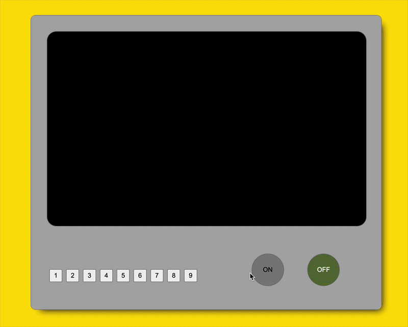

# 📺 UI About Like a TV

An interactive portfolio inspired by a retro television.

No AI is used.

Instead of navigating through ordinary menus, users turn on the TV, switch channels, and explore different parts of my portfolio just like watching television.

Each channel displays a custom-designed thumbnail and provides quick access to my portfolio, GitHub, Figma, OpenProcessing, and other creative works.

---

## 🌐 Live Demo

https://hashio251.github.io/02_ui-about-like-a-tv/

---

## 📸 Preview



---

# 🎯 Concept

This project originally started as a JavaScript practice exercise.

While developing it, I realized that the TV channel concept could become a fun way to navigate my portfolio.

Rather than simply switching images, each channel now works as a gateway to one of my creative platforms.

My goal was to create an interface that encourages visitors to explore my work in a playful and memorable way.

---

# ✨ Features

## 📺 Channel Navigation

Use the number buttons to switch channels.

Each channel displays a custom thumbnail that I designed in Photoshop and links to one of my creative platforms.

| Channel | Destination |
| ------- | ----------- |
| CH1 | Portfolio |
| CH2 | Website Collection |
| CH3 | Small Works Collection |
| CH4 | Figma |
| CH5 | Photoshop Works |
| CH6 | Illustrator Works |
| CH7 | OpenProcessing |
| CH8 | GitHub |
| CH9 | Digital Clock |

Clicking the TV screen opens the selected destination in a new browser tab.

---

## 🔌 Power System

- Power ON / OFF
- CRT-style startup animation
- Welcome screen
- TV power state management

---

## 🎨 Retro TV UI

- Vintage television inspired design
- Animated screen transitions
- Interactive button controls
- Responsive image switching

---

# 🖼 Custom Thumbnails

Every channel uses a custom thumbnail created by me in Photoshop.

To keep the interface consistent, each category has its own color while following a unified design system.

Examples include:

- Portfolio
- Website Collection
- Photoshop
- Illustrator
- Figma
- OpenProcessing
- GitHub

These thumbnails make it easy to recognize each destination while maintaining the retro TV aesthetic.

---

# 🛠 Built With

- HTML5
- CSS3
- Vanilla JavaScript
- Photoshop
- Git
- GitHub
- GitHub Pages

---

# 💡 JavaScript Highlights

This project demonstrates:

- DOM Manipulation
- Event Listeners
- State Management
- Arrays & Objects
- Conditional Statements
- Dynamic Image Switching
- setTimeout()
- CSS Animation Control
- External Link Navigation

---

# 📁 Project Structure

```text
ui-about-like-a-tv/
├── index.html
├── assets
│   ├── css
│   │   └── style.css
│   ├── js
│   │   └── main.js
│   └── images
│       ├── loading/
│       └── ui/
└── README.md
```

---

# 🚀 Future Improvements

- Startup sound
- Channel switching animation
- Previous / Next channel buttons
- Volume control
- Keyboard remote controller
- Weather API
- News API
- YouTube channel
- React version

---

# 📚 What I Learned

During this project I learned how to:

- Manage application state
- Organize data using arrays and objects
- Update the DOM dynamically
- Handle user interactions
- Build reusable JavaScript functions
- Create UI animations
- Improve an existing project by adding new ideas

---

# 👨‍💻 Author

**Hashio**

### 🌐 Portfolio

https://hashio251.github.io/

### 💻 GitHub

https://github.com/hashio251

### 🎨 Figma

https://www.figma.com/board/yDzidSITPcv3zB1YrIYiRK/hashio%E3%81%AE%E4%BD%9C%E5%93%81%E9%9B%86

### 🧩 OpenProcessing

https://openprocessing.org/user/532184/#sketches

---

Thank you for visiting my project!